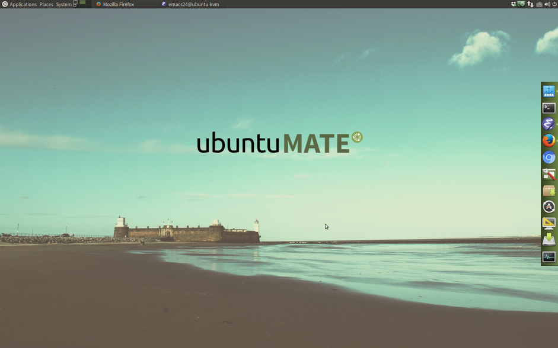
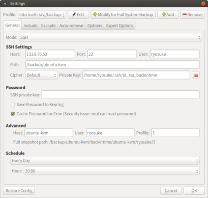
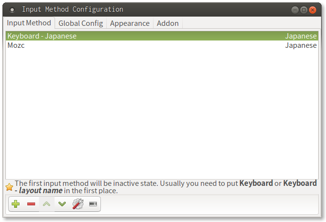

<!-- home-ryosuke-pack/manual/installedApps.md -->
# Procedure manual for the initial setup on Ubuntu MATE 17.04 #


Time-stamp: <2018-04-17 18:56:31 (ryosuke)>

<!-- ------------------------------------------------------------------- -->
## Installing basic tools ##
<!-- ------------------------------------------------------------------- -->
### git ###
```shell
> sudo apt-get install -y git lv meld curl tig gibo
```
<!-- [Official URL](https://git-scm.com/) -->


### ssh ###
* Check the version of ssh installed
```shell
> ssh -V
```

* Set up the default identity
```shell
> ssh-keygen
> ssh-add ~/.ssh/id_rsa
> ssh-add -l
```

* Install the public key on
[Bitbucket.org](https://bitbucket.org/) and
[Github.com](https://github.com/)
```shell
> sudo apt-get install -y xclip
> xclip -sel clip < ~/.ssh/id_rsa.pub
```

	Paste the public key on the clipboard into the "Add SSH key" field
     on Bitbucket.org and on Github.com.

<!-- ------------------------------------------------------------------- -->
## Pull my configuration files from [Bitbucket.org](https://bitbucket.org/yamryo/home-ryosuke-pack) ##
<!-- ------------------------------------------------------------------- -->
```shell
> mkdir ~/tmp
> cd ~/tmp
> git clone git@bitbucket.org:yamryo/home-ryosuke-pack.git
```

<!-- ------------------------------------------------------------------- -->
## Configurations ##
<!-- ------------------------------------------------------------------- -->
### Tidying up the home directory ###
* arrange directories and dot files
```shell
> cd ~/tmp/home-ryosuke-pack/script
> ./set-home-dir-up.sh
```

### On the Control Center ###
* Keyboard

	Layouts/Options/Caps Lock key behavior/Make Caps Lock an additional Ctrl

* Keyboard Shortcut

	Remove 'Alt' from shortcuts for switching workspaces

* Screensaver

	Check out "Lock screen when screensaver is activate"

### MATE Panel ###

Set like this



<!-- ------------------------------------------------------------------- -->
## Installing Applications ##
<!-- ------------------------------------------------------------------- -->
### emacs25 ###
* install
```shell
> sudo apt-get install emacs25 emacs-mozc-bin cmigemo
```
* setting up configuration files
```shell
> git clone git@bitbucket.org:yamryo/emacs_cfg.git ~/.emacs.d
> cd ~/.emacs.d
> git submodule init
> git submodule update
```
* install packages by package.el

	Launch emacs and type 'M-x my-package-install'

### Vim ###
* install
```shell
> sudo apt-get install vim
> cp ~/tmp/home-ryosuke-pack/configuration/no-auto-copy.config/.vimrc ~
```

### tmux ###
terminal multiplexer ([tutorial on Qiita ](https://qiita.com/hockeykozo/items/9710df7c33d3a92d61ce))

* install
```shell
> sudo apt-get install tmux
```
* putting configuration files
```shell
> cp -r ~/tmp/home-ryosuke-pack/configuration/no-auto-copy.config/.tmux ~
> ln -s ~/.tmux/config/default ~/.tmux.conf
```
* install plugins by using [Tmux Plugin Manager](https://github.com/tmux-plugins/tpm)
```shell
> git clone https://github.com/tmux-plugins/tpm ~/.tmux/plugins/tpm
```

	Launch tmux and type 'prefix I'

### Back in Time ###
a backup tool with rsync ([official page](https://backintime.readthedocs.io/))

* install
```shell
> sudo apt-get install backintime-common
```
* setting for backup onto an external server via ssh

	Create group 'fuse' and add the user who execute backup to the group.
```shell
> ssh-keygen -t rsa
```
	You might want to set a file name of the key to id_rsa_backintime.
	The empty passphrase is acceptable.
```shell
> ssh-copy-id -i ~/.ssh/id_rsa_backintime.pub <REMOTE_USER>@<HOST>
```
	Then you can choose ssh backup in Settings Dialog.

	

### TeXLive ###
* install
```shell
> sudo apt-get install texlive-base texlive-lang-cjk texlive-math-extra latex-beamer
```

### Dropbox ###
* install and setting up
```shell
> sudo apt-get install caja-dropbox
```
	You can install dropbox from Ubuntu Software Center.

	Click 'Menu/Internet/Dropbox' to set up

### Ruby with rbenv ###
* install rbenv
```shell
> git clone https://github.com/rbenv/rbenv.git ~/.rbenv
> git clone https://github.com/rbenv/ruby-build.git ~/.rbenv/plugins/ruby-build
> rbenv rehash
```
* install the latest ruby and bundler

	Check [the latest version](https://www.ruby-lang.org/) of ruby
```shell
> rbenv install -l | more
```
	Install the latest (for instance 2.2.2)
```shell
> rbenv install 2.2.2
> rbenv rehash
> rbenv versions
> rbenv global 2.2.2
> rbenv exec gem install bundler
```
* for SQLite database engine
```shell
> sudo apt-get install sqlite3
```

### Guake Terminal ###
* install
```shell
> sudo apt-get install guake
```
* setting

	Right click guake's tray icon and choose Preferences

	* General: Hide on lose focus --> on
	* Keyboard shortcuts: Toggle Guake visibility --> Menu

<!-- ------------------------------------------------------------------- -->
## Input method for Japanese ##
<!-- ------------------------------------------------------------------- -->
* install
```shell
> sudo apt-get install fcitx-mozc
```
* setting up

	Right click the keyboard icon on the top panel,
	choose "Configure", and then set input methods as follows;

	

	Set "Global Config/Hot keys/Trigger Input Method" to be "Muhenkan" and "ZenkakuHankaku"

* Add dictionaries for smart conversion

1. Download `mozc-ut-2.17.2097.102.20150529a.tgz`

1. Install tools to build deb packages
```shell
> sudo apt-get install -y clang libdbus-1-dev libglib2.0-dev libgtk2.0-dev subversion tegaki-zinnia-japanese debhelper libibus-1.0-dev build-essential libssl-dev libxcb-xfixes0-dev python-dev gyp protobuf-compiler libprotobuf-dev libqt4-dev libuim-dev libzinnia-dev fcitx-libs-dev devscripts ninja-build
```

1. Build
```shell
> cd ~/Download
> tar xavf ./mozc-ut-2.17.2097.102.20150529a.tgz
> cd mozc-ut-2.17.2097.102.20150529a/
> sudo ./build_mozc_plus_utdict
```

1. Clean up
```shell
> tail -n 5 /var/log/apt/history.log | grep Install: | sed -e s/"Install: "// | sed -e s/", automatic"//g | sed -e s/"), "/"\n"/g | sed -e s/":amd64.*$"/""/g | tr '\n' ' ' | xargs sudo apt-get remove -y
```

1. Install deb packages for the dictionary
```shell
> sudo apt-get remove mozc-server mozc-utils-gui emacs-mozc fcitx-mozc emacs-mozc-bin mozc-data
> sudo dpkg -i mozc*.deb fcitx-mozc*.deb
```
> **CAUTION!!**
> Before installing the deb packages built above,
> you should remove the packages which conflicts them.

<!--
### Conky ###
* install
```shell
> sudo apt-get install conky-all
> git clone git@bitbucket.org:yamryo/conky_cfg.git ~/.conky
```
-->

<!-- ------------------------------------------------------------------- -->
## Start-up Applications ##
<!-- ------------------------------------------------------------------- -->
### Add ###

* Guake
* Plank

### Delete ###

* Buleman Applet
* Ocra screen reader
* PulseAudio Sound System
* Volume Control

<!-- ------------------------------------------------------------------- -->
## Other optional applications and settings ##
<!-- ------------------------------------------------------------------- -->

* Change the default editor from nano to vim
```shell
> sudo update-alternatives --config editor
```

	This command shows a list of editors you can choose. Select vim-basic from the list.

* Pandoc

	A document converter mainly used in conversion from markdown to
    html on emacs. ([official page](https://pandoc.org/))
```shell
> sudo apt-get install pandoc
> cd ~/tmp/home-ryosuke-pack/configuration/no-auto-copy.config
> cp -r .pandoc ~
```

	Uncomment the following line in ~/.emacs.d/elisp/other-config.el.
```Emaps-Lisp:other-config.el
;(setq markdown-command "pandoc -c ~/.pandoc/github.css")
```

* Zsh
```shell
> sudo apt-get install zsh
```

    Setting up:

    1. Copy configuration files from home-ryosuke-pack
```shell
> cd ~/tmp/home-ryosuke-pack/configurations/not-auto-copy.config/
> cp -r .zsh.d .zshenv ~
```
Or manually put all configuration files for zsh into ~/.zsh.d
```shell
> mkdir ~/.zsh.d
> echo "export ZDOTDIR='$HOME/.zsh.d'" >> ~/.zshenv
```

    1. Set Zsh the default shell of tmux.
    Comment out the following line in ~/.tmux.conf
```Tmux:~/.tmux.conf
set-option -g default-shell /use/bin/zsh
```

    1. Install [Zplug](https://github.com/zplug/zplug), a plugin manager for zsh
```shell
> mkdir ~/.zsh.d/.zplug
> echo "export ZPLUG_HOME='$ZDOTDIR/.zplug'" >> ~/.zshenv
> tmux
> git clone git@github.com:zplug/zplug $ZPLUG_HOME
```

* Other goodies
```shell
> sudo apt-get install keepassx filezilla inkscape geany qpdfview
```

<!-- ------------------------------------------------------------------- -->
## MEMO ##
<!-- ------------------------------------------------------------------- -->

* Use 'sudoedit' instead of 'sudo vim', because 'sudo vim' create a
  file ~/.viminfo owned by root.

*
